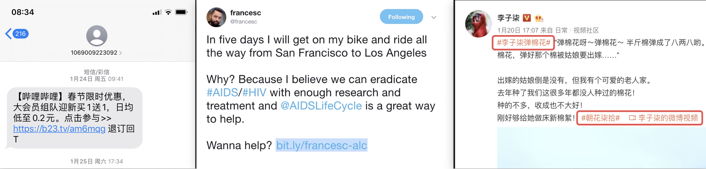
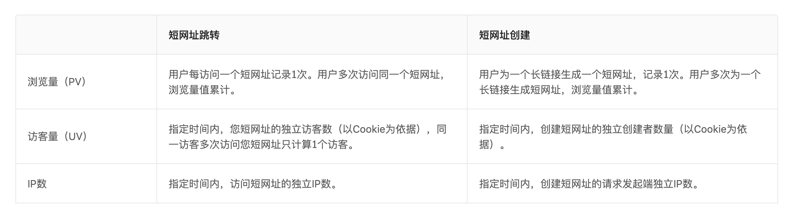
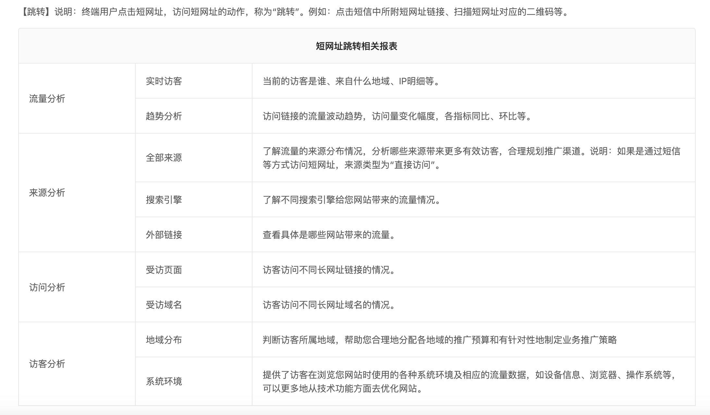
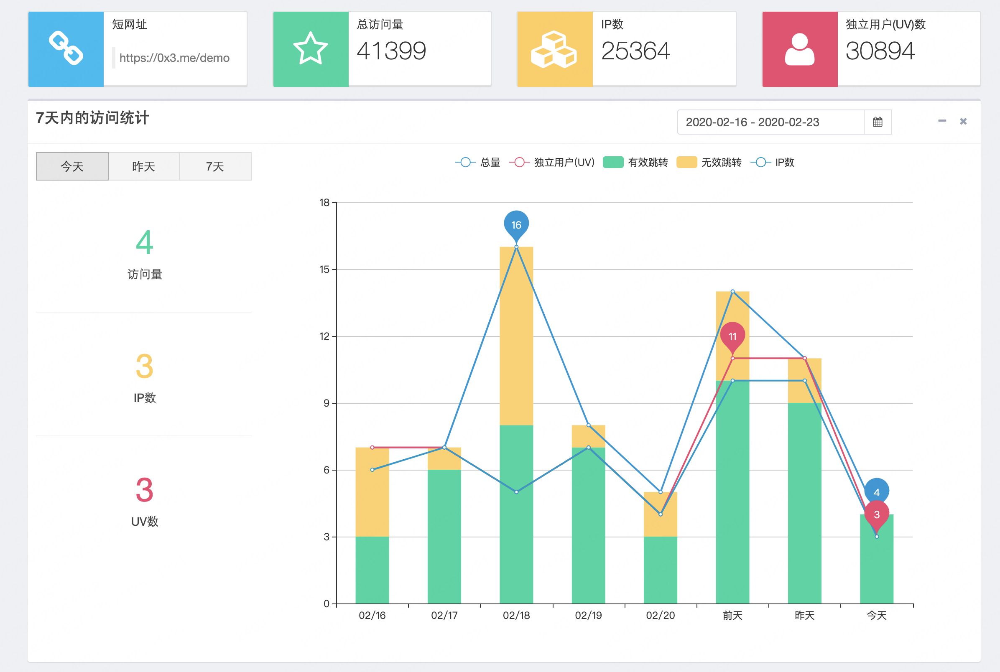

## 短地址服务

> 1.什么是短地址服务

将长地址缩短到一个很短的地址，用户访问这个短地址可以重新定位到原本的长地址。



> 2.短地址的使用场景


> 3.数据分析报表




示例图：



### 设计思路

1. 通过哈希算法生成短网址，需要关心哈希算法的计算速度和冲突概率。
2. 为了让短网址更短，可以将 10 进制的哈希值转换成更高进制的哈希值。
3. 解决哈希冲突，可以搜索数据库发现冲突，然后在原网址后面添加特殊字符，重新计算哈希值。
4. 如何提升短网址生成性能，两次数据库交互（查询、写入），是性能瓶颈的关键，可以使用唯一索引，减少 SQL 的次数。
5. 高性能的 ID 生成器，思路同 [didi/tinyid](https://github.com/didi/tinyid)

### 接口文档

> 1.生成短地址接口

```
> POST /api/shorten
Content-Type: application/json;charset=utf-8
Params：
  {
    "url": "https://www.baidu.com",
    "expiration_in_minutes": 100
  }
Response：
  {
      "code": "0",
      "errMsg": "OK",
      "data": {
          "shortUrl": "8dxu",
          "longUrl": "https://www.baidu.com"
      }
  }
```

> 2.短地址还原接口

```
> GET /api/info?url=8dxu
Response：
  {
      "code": "0",
      "errMsg": "OK",
      "data": {
          "url": "https://www.baidu.com",
          "created_at": "2020-02-24 12:21:02.151994 +0800 CST m=+94.081029585",
          "expiration_in_minutes": 100
      }
  }
```

> 3.短地址访问-重定向（307）

```
$ curl http://127.0.0.0.1:8080/8dxu
```

### RoadMap

1.接口调用-Token验证

2.限流算法

3.采集数据（客户端IP、设备类型、网络运行商等）

4.绘制统计图表
